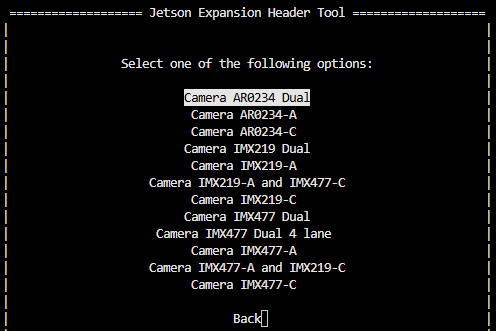
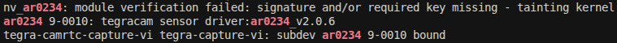
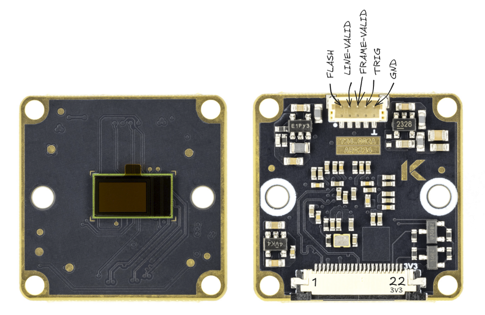

# AR0234 kernel driver for NVIDIA Jetson


NVIDIA Jetson kernel driver for Onsemi AR0234, a 2.3 MP global shutter 1/2.6" CMOS sensor.

- 2-lane MIPI CSI-2
- 10-bit RAW output
- 1920×1200 @ 60 fps

## Setup

Install required tools:

```bash
sudo apt install -y --no-install-recommends dkms
```

Clone this repository:

```bash
cd ~
git clone https://github.com/Kurokesu/ar0234-jetson-driver.git
cd ar0234-jetson-driver/
```

Run setup script:

```bash
sudo ./setup.sh
```

Setup script:
- Fetches NVIDIA device tree headers required for build
- Builds and installs kernel module via [DKMS](https://github.com/dell/dkms)
- Builds and copies device tree overlay (`.dtbo`) to `/boot`

Optionally, install the ISP tuning file:

```bash
sudo cp ./tuning/camera_overrides.isp /var/nvidia/nvcam/settings
```

To restore default ISP parameters, remove the overrides file:

```bash
sudo rm /var/nvidia/nvcam/settings/camera_overrides.isp
```

Use Jetson-IO to configure the CSI connector:

```bash
sudo /opt/nvidia/jetson-io/jetson-io.py
```

Navigate through the menu:
1. Configure Jetson CSI Connector (named "22pin" on 6.2.2, "24pin" on 6.2.1)
2. Configure for compatible hardware
3. Select port configuration:
   - **Camera AR0234-A** - cam0
   - **Camera AR0234-C** - cam1
   - **Camera AR0234 Dual** - cam0 + cam1



4. Save pin changes
5. Save and reboot to reconfigure pins

After reboot, verify sensor is detected:

```bash
sudo dmesg | grep ar0234
```



## Image output

### GStreamer

Single:

```bash
gst-launch-1.0 -e nvarguscamerasrc sensor-id=0 ! \
   'video/x-raw(memory:NVMM),width=1920,height=1200,framerate=30/1' ! \
   queue ! nvvidconv ! queue ! nveglglessink
```

Dual:

```bash
gst-launch-1.0 -e \
   nvarguscamerasrc sensor-id=0 ! \
      'video/x-raw(memory:NVMM),width=1920,height=1200,framerate=30/1' ! \
      queue ! nvvidconv ! queue ! nveglglessink \
   nvarguscamerasrc sensor-id=1 ! \
      'video/x-raw(memory:NVMM),width=1920,height=1200,framerate=30/1' ! \
      queue ! nvvidconv ! queue ! nveglglessink
```

### NVIDIA sample camera capture application

```bash
nvgstcapture-1.0 --sensor-id 0
```

## Trigger modes

AR0234 supports two external trigger modes. Both use `TRIG` pin on camera module as external signal input. `TRIG` is a **1.8V logic level** input wired directly to sensor. Trigger pulse only initiates capture, exposure time remains controlled by sensor's integration time register.

`TRIG` and `FLASH` signals are available on AUX connector:



*Full module pinout and AUX connector part number are documented in [234x-CSI wiki page](https://wiki.kurokesu.com/books/mipi-csi2-camera-modules/page/234x-csi).*

| trigger_mode | Description |
| ------------ | ----------- |
| 0 | Off (free-running, default) |
| 1 | External trigger (pulsed/automatic) |
| 2 | Sync-sink |

### external-trigger

Sensor stays in standby and waits for activity on `TRIG` pin. Exposure and readout happen sequentially: readout does not begin until exposure is complete. Two sub-modes are available:

- **Pulsed**: each high pulse on `TRIG` pin captures a single frame (minimum pulse width 125 ns, 3 EXTCLK cycles at 24 MHz). Framerate is determined by pulse frequency.
- **Automatic**: if `TRIG` signal stays high, sensor outputs frames continuously at configured framerate.

```bash
echo 1 | sudo tee /sys/module/nv_ar0234/parameters/trigger_mode
```

After enabling trigger mode start sensor stream via `v4l2`. Frames will arrive when there is signal on `TRIG`.

```bash
v4l2-ctl -d /dev/video0 --set-ctrl override_capture_timeout_ms=-1 --stream-mmap --stream-count=1000 --stream-to=/dev/null
```

*Without `override_capture_timeout_ms=-1` capture fails if first trigger arrives later than default 2.5 s VI timeout. On Argus path use `enableCamInfiniteTimeout=1` instead.*

### sync-sink

Sensor streams continuously but locks frame timing to external `TRIG` signal. Unlike `external-trigger`, exposure and readout overlap (pipelined), so higher framerates are possible. Trigger period must not be shorter than configured frame length.

```bash
echo 2 | sudo tee /sys/module/nv_ar0234/parameters/trigger_mode
```

### Disable trigger

```bash
echo 0 | sudo tee /sys/module/nv_ar0234/parameters/trigger_mode
```

## Flash output

AR0234 has a `FLASH` output pin (1.8V logic level) that goes HIGH during sensor exposure, useful for synchronizing external illumination such as strobes or LEDs.

| Parameter | Type | Description |
| --------- | ---- | ----------- |
| flash | bool | Enable flash output on FLASH pin |
| flash_delay | int | Signed delay (-127..127), negative = lead, positive = lag |

To enable flash output:

```bash
echo Y | sudo tee /sys/module/nv_ar0234/parameters/flash
```

The flash signal start can be shifted relative to exposure using `flash_delay`:

- **Negative values** (lead): flash starts *before* exposure, extending total flash time
- **Positive values** (lag): flash starts *after* exposure begins, shortening total flash time

`flash_delay` accepts values in the range of -127 to 127, where each unit is approximately **6.8 µs** (2-lane).

```bash
# Flash starts ~68 µs before exposure (2-lane)
echo -10 | sudo tee /sys/module/nv_ar0234/parameters/flash_delay

# Flash starts ~68 µs after exposure begins (2-lane)
echo 10 | sudo tee /sys/module/nv_ar0234/parameters/flash_delay
```

Disable flash output:

```bash
echo N | sudo tee /sys/module/nv_ar0234/parameters/flash
```

## Test mode

AR0234 has a built-in test pattern generator for verifying data validity.

Enable test pattern:

```bash
# 100% color-bar test pattern (test_mode = 2)
echo 2 | sudo tee /sys/module/nv_ar0234/parameters/test_mode
```

Turn test pattern off:

```bash
echo 0 | sudo tee /sys/module/nv_ar0234/parameters/test_mode
```

| Test pattern code | Description |
| ----------------- | ----------- |
| 0 | Off (normal operation) |
| 1 | Solid color |
| 2 | 100% color bar |
| 3 | Fade-to-grey color bar |
| 256 | Walking 1s (10-bit) |

## Development builds

For manual builds without DKMS:

```bash
make              # build everything (dtbo + kernel module)
sudo make install # copy dtbo to /boot, rmmod + insmod
```

> [!NOTE]
> Module is loaded immediately via `insmod` but won't persist across reboots. Use `sudo ./setup.sh` for permanent installation via DKMS.

Individual targets:

```bash
make dtbo      # build only the device tree overlay
make module    # build only the kernel module
make clean     # remove build artifacts
```

Build artifacts are placed in `./build`.
